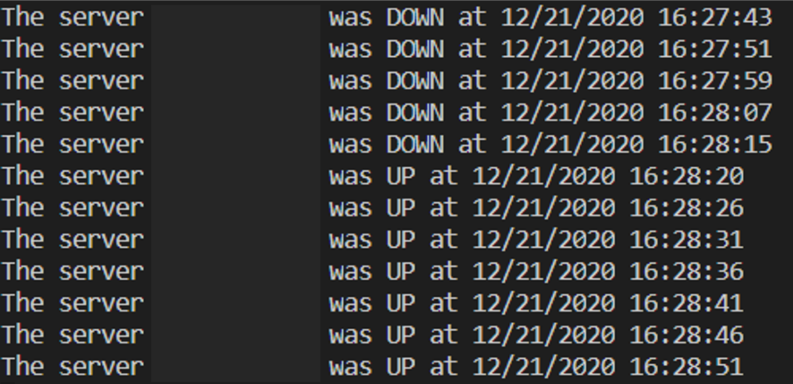

# Python Server Monitoring tool

The Python server uptime monitoring tool is a command line tool which is developed with Python and Scapy which sends ping to the server or required system every 5 seconds and displays on the screen if the server was up or down at specified time. The IP address of the server / system is specified in the code before execution. The tool run on Ubuntu Server 20.04.1.

## Lab Setup
- OS: Ubuntu Server 20.04.1
- Python: 3.6.9
- Scapy: 2.4.4

## Code Output

